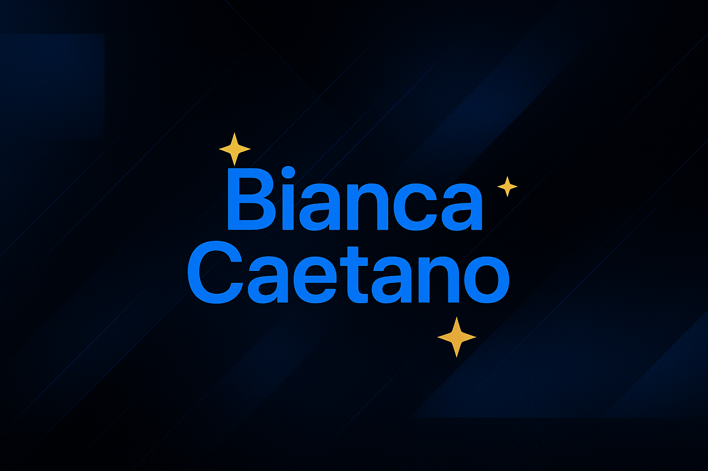

<header style="text-align: center;">
  <figure style="position: relative; display: inline-block;">
    
    ⭐
    ⭐
    ⭐
    ⭐
    ⭐
    ⭐
    
  </figure>
</header>

# Olá! 👋

Desenvolvedora em formação com foco em **Front-end**, interessada em construir aplicações web modernas, bem estruturadas e orientadas a boas práticas de Engenharia de Software.

Tenho perfil analítico, curiosidade técnica e aprendizado contínuo como prioridade. Evoluo através de projetos práticos, estudo consistente e colaboração com a comunidade de desenvolvimento.

---

## 👩‍💻 Sobre mim
- 🔭 Desenvolvimento de aplicações web front-end
- 🌱 Aprendizado contínuo em **JavaScript, Vue.js, React** e arquitetura de aplicações
- 👯 Interesse em colaborar em projetos open source
- 🤔 Foco em **qualidade de código, performance, legibilidade e manutenibilidade**

---

## 🤝 Conecte-se comigo

  

---

## 🧠 Tecnologias & Ferramentas

<table>
  <tr>
    <th>Front-end</th>
    <th>Ferramentas de Desenvolvimento</th>
    <th>Cloud & Deploy</th>
    <th>AI & Automação</th>
  </tr>
  <tr>
    <td align="center">
      
    </td>
    <td align="center">
      
    </td>
    <td align="center">
      
    </td>
    <td align="center">
       
      
    </td>
  </tr>
</table>

---

## 🧩 Como eu trabalho
- Organização de código baseada em **componentização e reutilização**
- Uso de **Git com commits claros e semânticos**
- Criação de interfaces **responsivas e acessíveis**
- Consumo de **APIs REST** e tratamento de estados da aplicação
- Atenção à **qualidade, legibilidade e manutenibilidade** do código

---

## 📌 Objetivo
Atuar como **desenvolvedora front-end em estágio, trainee ou posição júnior**, contribuindo com times de produto, aprendendo com desafios reais e evoluindo tecnicamente de forma consistente.

---

📂 Explore meus repositórios para acompanhar minha evolução técnica.  
**Projetos focados em Front-end, componentização, consumo de APIs REST e aplicação de boas práticas de desenvolvimento.**
